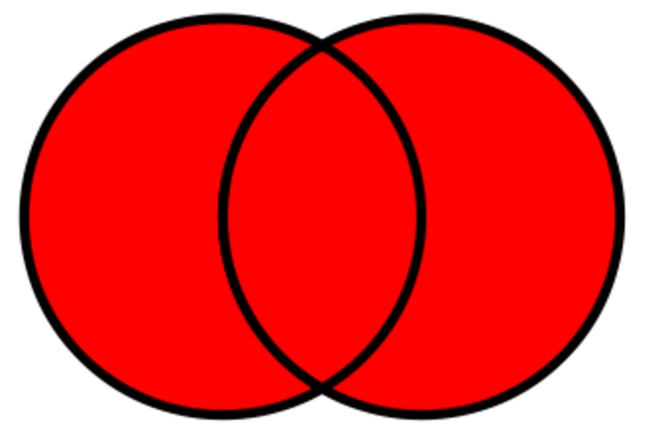
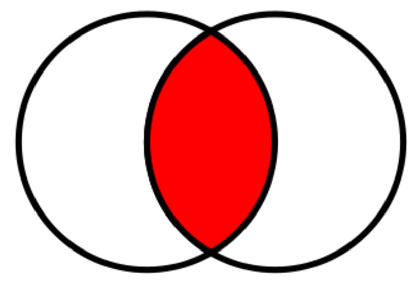
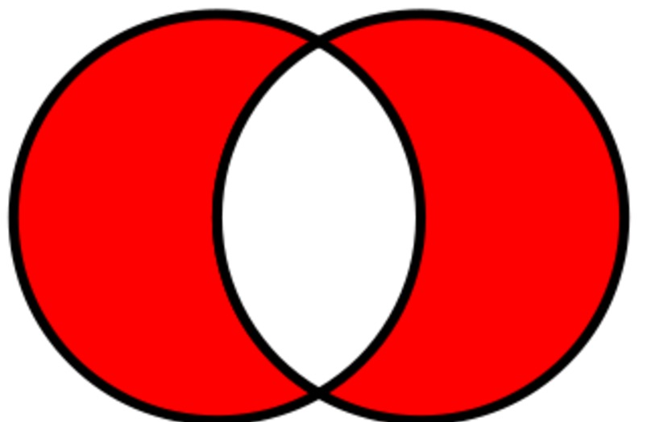

# Boolean algebra

|  Name | Symbol | logical operator | bitwise operator  | Explanation  |
|:-:|:-:|:-:|:-:|:-:|:-:|
| not| &not; | !  | ˜ |   |
| and | ∧ | && | &|   | | 
| or |  ∨ | \|\| | \| ||   
| xor | &oplus;   | != |  ^  | | 

# Set Operations
|  Union | Interesection | Disjunctive union |
|:-:|:-:|:-:|
|  |  |  |
